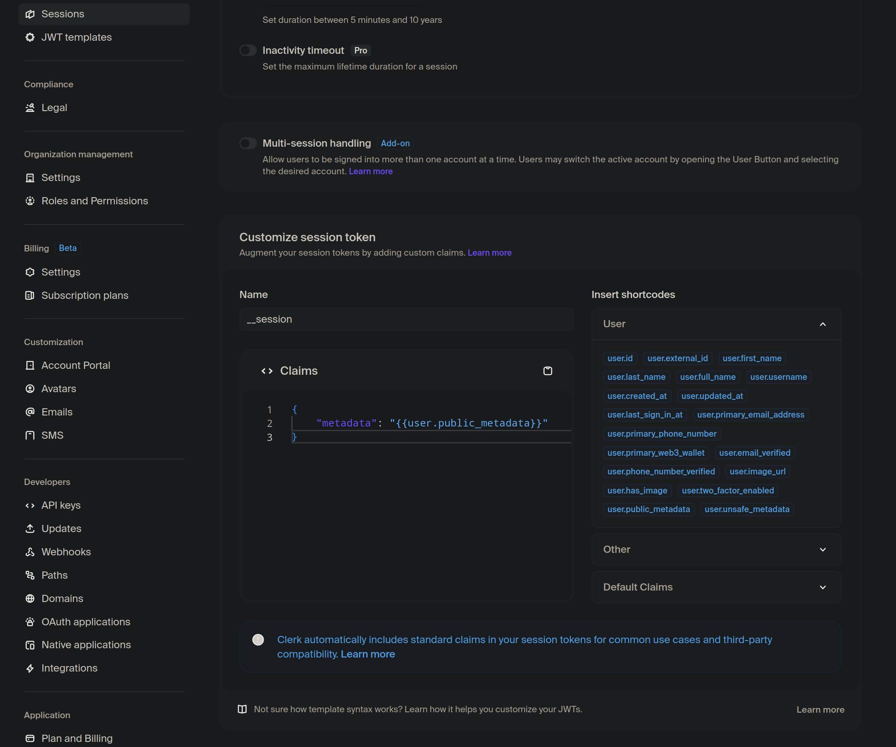
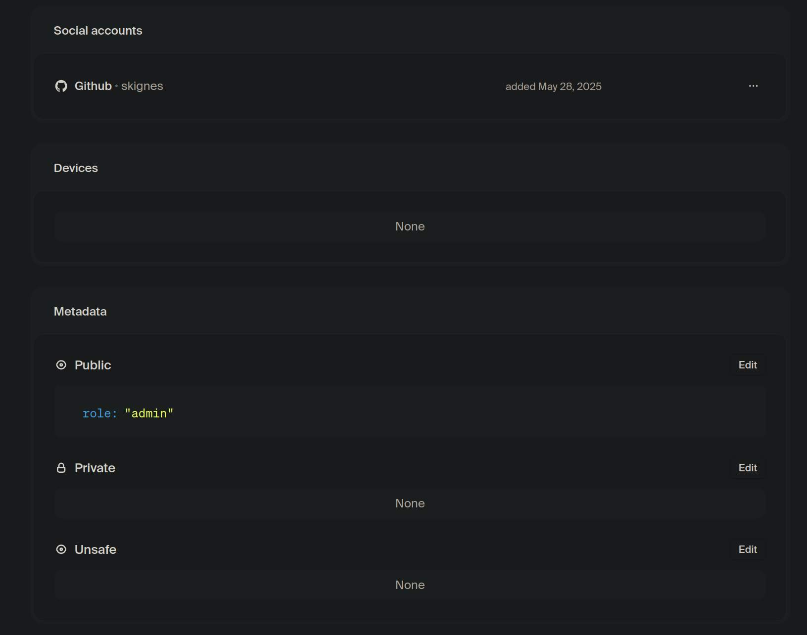
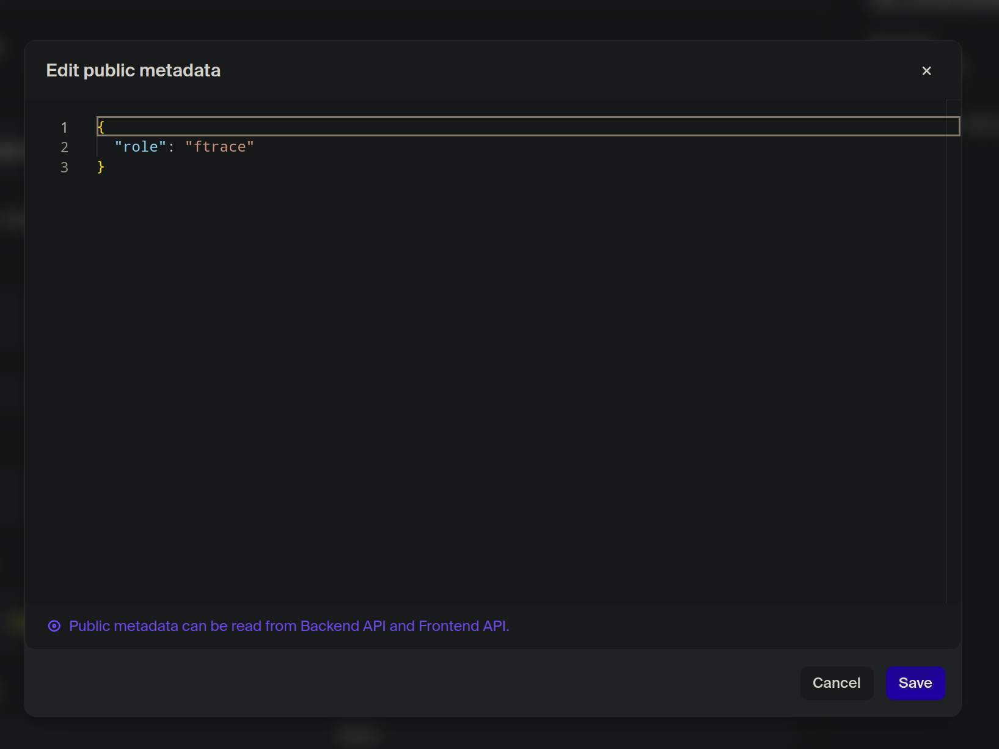
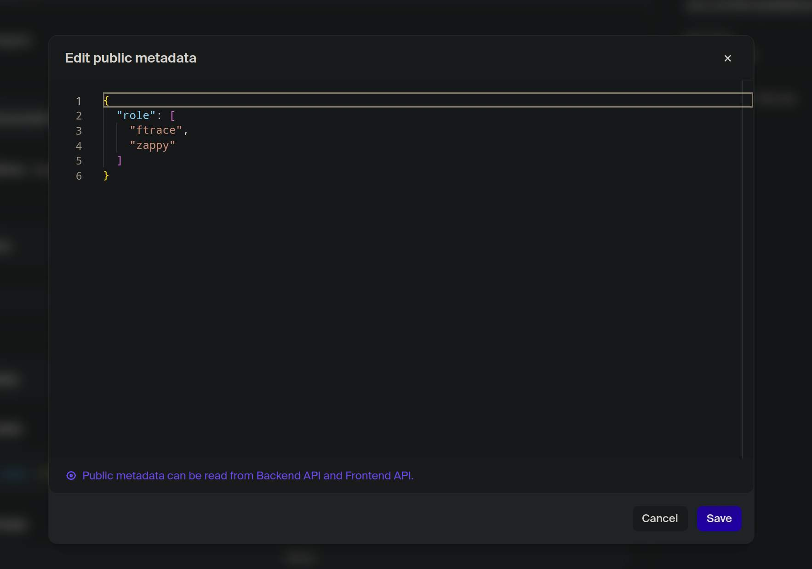
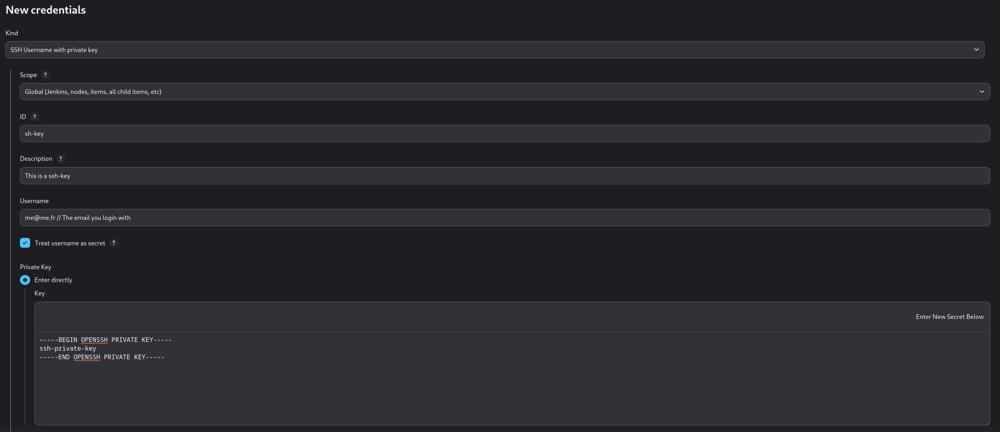
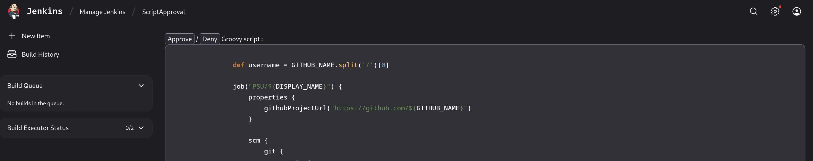
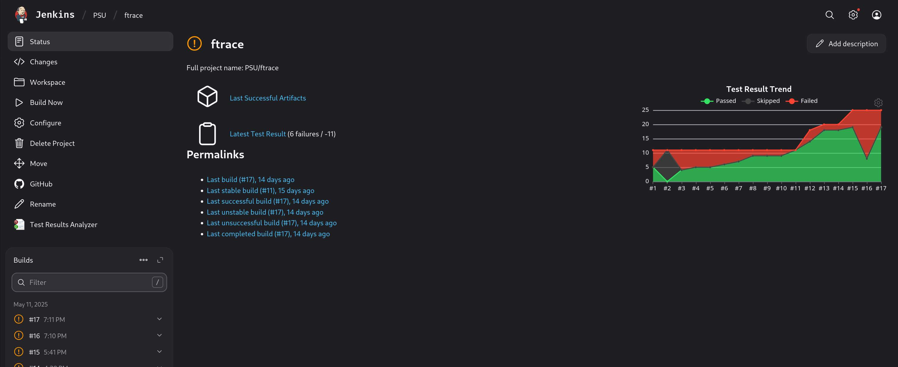

# Platypus Checker

Platypus Checker is a complete **Jenkins** setup designed to automate the process of testing and validating your projects.

## Table of Contents

- [Prerequisites](#prerequisites)
- [Setup](#setup)
- [Usage](#usage)
- [Create Json](#create-json)
- [Update](#update)
- [Build With](#build-with)
- [Contributors](#contributors)
- [Contributing](#contributing)
- [License](#license)

## Prerequisites

- A linux machine with **Docker** installed.
- Access to your code repository.
- A **Clerk** account.

## Setup

The setup process is divided into three main parts: **Jenkins**, **Clerk**, and the **Frontend**.

---

### 1. Jenkins Setup

1. **Clone this repository to your machine:**

    ```bash
    git clone https://github.com/skignes/Platypus-Checker.git
    cd Platypus-Checker
    ```

2. In the `docker-compose` file, change the environment variable named `FRONTEND_URL` to the URL of your frontend.

    ```docker-compose
    environment:
      FRONTEND_URL: "http://<your-url>/"
      CASC_JENKINS_CONFIG: "/var/jenkins_home/casc_configs"
      USER_ADMIN_PASSWORD: "admin"
      USER_API_PASSWORD: "api"
      BINARY: "/opt/jenkins/binary"
      JSON: "/opt/jenkins/json"
    ```

3. **Build the Jenkins instance:**

    ```bash
    docker compose build jenkins
    ```

4. **Start Jenkins:**

    ```bash
    docker compose up jenkins -d
    ```

5. **Access Jenkins:**
   Open `http://<your-ip>:8080` in your browser.

    - Default credentials:
        - **User:** `admin`
        - **Password:** `admin`

---

### 2. Clerk Configuration

1. **Configure Clerk metadata:**

    - In your Clerk dashboard, go to **Configure** > **Session**.
    - Under customization for `sessions`, add:

    ```
    {
        "metadata": "{{user.public_metadata}}"
    }
    ```

    - It should look like this:

    

> [!NOTE]
> The next step is optional

2. We advise for **public deployment** to create a **production** instance on your clerk dashboard. Please follow the relevent documentation : https://clerk.com/docs/deployments/overview

3. **Set user permissions:**

    - When connecting via GitHub, users will not have access by default.
    - Assign permissions in the **metadata** section for each user:
        - `admin`: Access to all projects.
        - `ftrace`: Access to the `ftrace` project.
        - `zappy`: Access to the `zappy` project.
        - Multiple permissions can be assigned as a list.

    - Example for `admin` permission:

    

    - Example for `ftrace` permission:

    

    - Example for multiple permissions:

    

---

### 3. Frontend Setup

1. **Create an environment file in the `frontend` directory:**

    - Connect as the `api` user (password: `api`) in Jenkins.
    - Create a new API Key at: `http://<your-ip>:8080/user/api/security/`
    - Go to the `frontend` directory and create/edit the `.env` file:

    ```bash
    cd frontend
    nvim .env
    ```

    - Add the following variables:

    ```env
    JENKINS_URL=**********
    JENKINS_API_KEY=**********
    JENKINS_USER=********** # Should be api
    NEXT_PUBLIC_CLERK_PUBLISHABLE_KEY=**********
    CLERK_SECRET_KEY=**********
    NEXT_PUBLIC_PRODUCTION=********** # true or false
    ```

    - For more details on Clerk, see the wiki.

2. **Build the frontend:**

    ```bash
    docker compose build frontend --no-cache
    ```

3. **Start the frontend:**

    ```bash
    docker compose up frontend -d
    ```

    - The frontend will be available at: `http://<your-ip>:3000`

## Usage

### SSH Key

To run the tests on your private repository you need to add a `ssh-key`. So to do so you need to run this command inside the docker :

```bash
# Go inside the docker
docker exec -it jenkins-platypus zsh
# Generate a new ssh key
ssh-keygen
# Add github to your know-host list
ssh-keyscan github.com >> ~/.ssh/known_hosts
```

Put the information you want.

When this is done you can now add this key to your **Github** account.

After you can now go into the [new credentials settings](http://localhost:8080/manage/credentials/store/system/domain/_/newCredentials) and add a new ssh key :



Now for each job in the settings of the build you can select the `credentials` to use for this repo and then you select your ssh-key.

You can build your private project now.

### Accept the script

I put a script protection to not execute everything i don't want on this jenkins.

So to be able to continue to the next step you need to accept the `seed` job script.

To do so you need to go into the [settings](http://localhost:8080/manage/scriptApproval/) and you will get a **Approve** and a **Deny**. I suggest you approve but this is up to you.



### Run the job

> [!IMPORTANT]
> The job will only run on the branch named `main`

So to run the job you first need to **seed** it. To do so you need to go into the `seed job` at the root of the jenkins.
You can build it with the name you want for the new job (the one the check will be done on), the directory the job will be inside of, and also the json file (Ex: `ftrace` for the `ftrace.json`).
Then You can find this job in the directory you specified.

When the job is build you will get a nice graph with the info if you :

- `passed`: The test was successfull
- `skipped`: The isn't even run cause the build failed
- `failed`: The test failed



To see the **Github** repository there is a github button. You can click on it and it will redirect you to the repository.

On the **workspace** part there is the log of the tests ran. And also the repository when it was clone.

> [!CAUTION]
> The job will fail if the repo just got created and no commits are made.

## Create Json

You can create a new `JSON` file for your personal project. Below is the required structure for the `JSON` file:

```json
{
    "test": {
        "build": "make",
        "tests": [
            {
                "Error-Handling": [
                    {
                        "name": "Bad argument server",
                        "command": "./exec this is not working",
                        "output": "*",
                        "return": 84
                    }
                ],
                "Functionnal-Test": [
                    {
                        "name": "Should work",
                        "command": "./exec",
                        "output": "*",
                        "return": 0
                    }
                ]
            }
        ]
    }
}
```

Here are the options available for each test:

- `grep`: Use this to filter the output and extract the desired information.
- `output`: Specify the exact output expected (can be `*` to match anything).
- `std`: Indicates the standard output to search for the expected output.
- `timeout`: Sets the timeout duration in seconds; the default is 10 seconds.

## Update

Keeping your services up to date ensures you benefit from the latest features and security patches. Follow the steps below to update Jenkins or the frontend:

### Update Jenkins

Rebuild and restart the Jenkins service to apply any changes:

```bash
docker compose build --no-cache jenkins
docker compose up jenkins -d
```

### Update Frontend

For the frontend, use the `--no-cache` flag to ensure a fresh build, then restart the service:

```bash
docker compose build --no-cache frontend
docker compose up frontend -d
```

## Build With

This project is built with:

- [](https://www.jenkins.io)
- [](https://www.docker.com)
- [](https://www.python.org)
- [](https://nextjs.org/)
- [](https://reactjs.org/)
- [](https://www.typescriptlang.org/)
- [](https://tailwindcss.com/)
- [](https://clerk.com/)
- [](https://pnpm.io/)

## Contributors

| Contributor | GitHub Profile |
|-------------|---------------|
|  | [Skignes](https://github.com/skignes) |
|  | [lg-epitech](https://github.com/lg-epitech) |

## Contributing

We welcome contributions! Please follow these guidelines:

- Use [Conventional Commits](https://www.conventionalcommits.org/en/v1.0.0/) for your commit messages.
    - For **new features**:

        ```bash
        feat(scope): description
        ```
        <sub>Example:</sub>
        ```bash
        feat(corewar): add corewar test
        ```

    - For **bug fixes**:

        ```bash
        fix(scope): description
        ```
        <sub>Example:</sub>
        ```bash
        fix(build): resolve Dockerfile path issue
        ```

Feel free to open issues or submit pull requests to improve the project.

## License

This project is licensed under the MIT License. See the [LICENSE](LICENSE) file for details.
